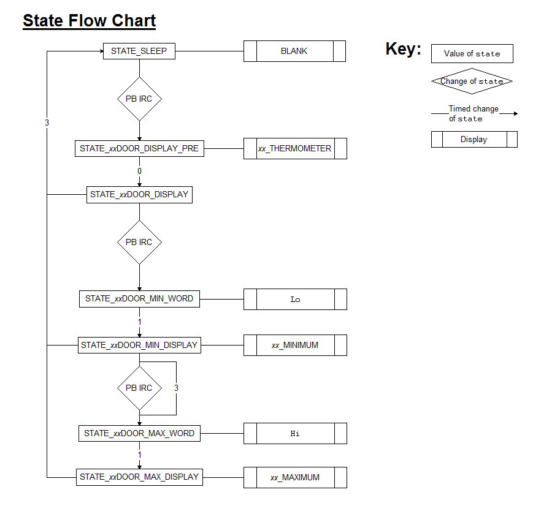

Cederberg Senior Scout Adventure 2014
=====================================
Electronics Base Thermometer
----------------------------

The project for [eBase 2014](http://www.sasebase.net) is an indoor/outdoor thermometer.  It is run of an ATmega88PA, with three 7seg LED displays, two pushbuttons, and a pair of indoor and outdoor thermistors, driven by 2 series AA battries.

Operation
---------
The human interaction is through three seven segment displays and two push buttons.

Pressing a pushbutton and releasing will result in the relevant temperature for 3 seconds.  If the button is pressed again within that time, the minimum (and then maximum on another pushbutton press) for that thermometer will be displayed.  The flow is shown below

Furthermore, holding down a pushbutton for 5 seconds will result in the relevant minimum and maximum being cleared.

Finally, holding both buttons down for 5 seconds will result in the system going into calibration mode, where either the indoor or outdoor thermometer can be calibrated.

Desgin Considerations
---------------------

The device is driven by 2 AA batteries.  As such, battery life is paramount.  The following steps will improve battery life.

 * The thermistors will only be driven whilst a reading is taken.  Due to parallel capacitors C4 and C5, a short time must elapse between the driving of the thermistors and the reading of the voltages.

 * The displays will be strobed.  That is, only one display is ever lit at a time.  However, they flash fast enough (83.3Hz) such that all three appear on at all times.

 * When the displays are not on and no reading is being taken, the microcontroller will be in "sleep mode".  This is an extremely low current draw mode.  Measurements were not accurate enough to determine actual current draw in sleep mode (noise was overriding).

In order to have accurate minimum and maximum temperatures, the temperature must be taken every minute or so.  The watchdog timer is used to wake the microcontroller from sleep and take a reading every 64 seconds.

To a computer programmer, the `thouloghundredth` function may seem odd.  Why not use a library to calculate log?  The reason is that we are not even afforded the privilidge of `long long`s much less `float`s.  All operations must be integer, and it turns out that a simple linear search on mesh points is accurate enough and easier to read than other searches.  Methods such as single polynomial approximation were found in experiments to be too inaccurate.

Temperature Calculations
------------------------

###Temperature

The equations governing thermistors can be found [here](http://en.wikipedia.org/wiki/Thermistor).  In brief they state that

    R = R_0 * exp(B * (1/T - 1/T_0))

Where `R_0`, `B` and `T_0` are given.  For this particular thermistor (the NXRT15XH103FA1B040), the nominal values are

    B   = 3380
    T_0 = 298.15
    R_0 = 10000

This means that, in the range -50C to 60C, the resistance ranges from about 3k to 453k.  Our series resistor of 10k, means that our voltage divider gives fractions in the range 0.231 to 0.978.

Reversing the above calculations, we see that

    T = B*T_0 / (B + T_0 * log(R / R_0))

We take `B` to be the only constant of calibration.

###Calibration

To calibrate, we take a reading of the resistor at a known temperature.  Then

    B = T_0 * T * log ( R / R_0) / (T_0-T)

In practice, the outdoor thermometer is immersed in ice and the temperature `T` is thus 273.15.  The indoor thermometer is calibrated by taking a reading off the outdoor thermometer and taking the indoor/outdoor temperature as the same.